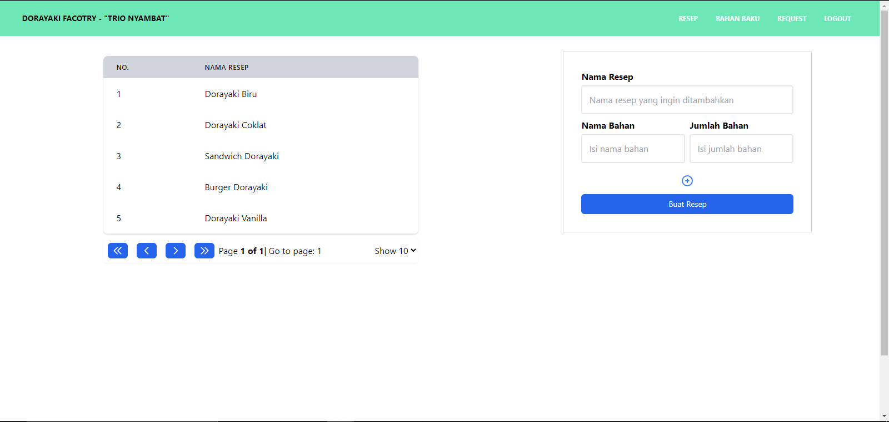
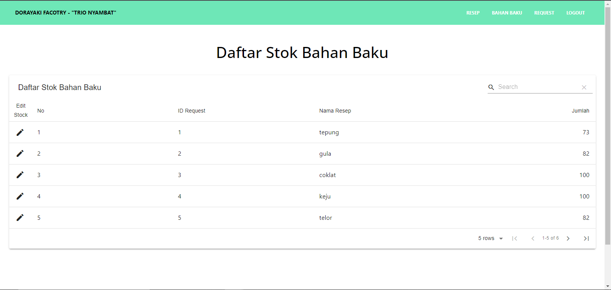
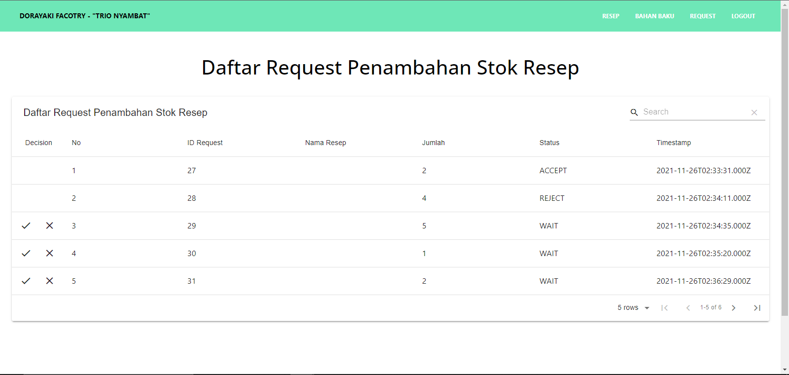
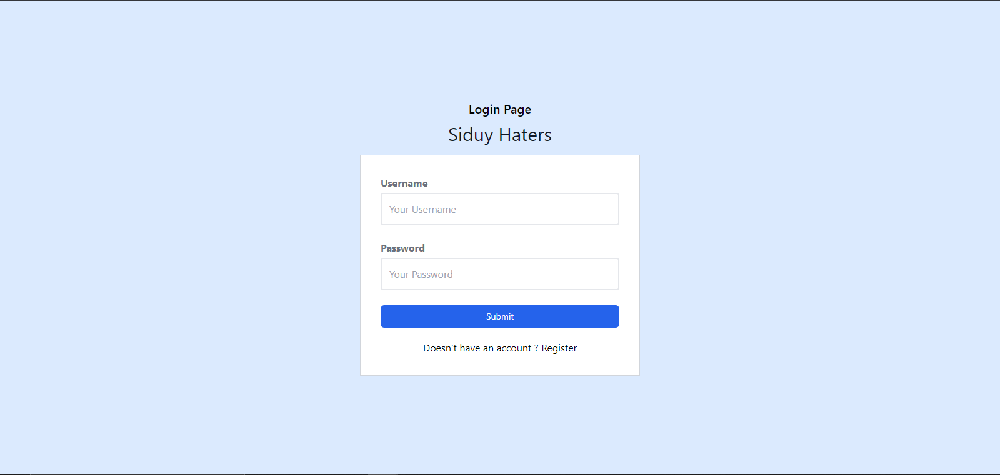
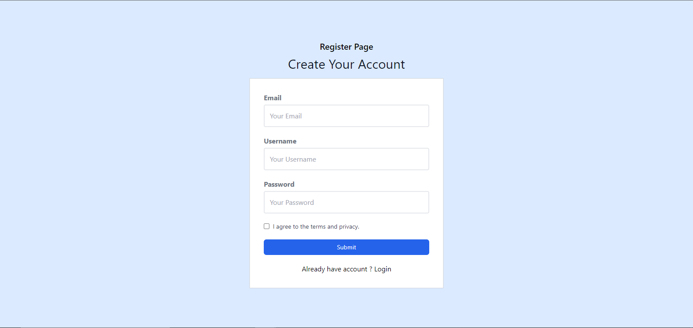

# Dorayaki-Factory-Client

Merupakan front-end dari aplikasi webservice pabrik dorayaki yang dibangun dengan framework react dalam bahasa typescript.

## Installation
1. Make sure you have [nodejs](https://nodejs.org/en/download/) installed.
2. Clone this repository to your computer.
3. Use node package manager to install dependencies this project needed.
```bash
npm install
```

## Screenshot
Gambar 1. 
Gambar 2. 
Gambar 3. 
Gambar 4. 
Gambar 5. 

## Contributing
1. Frontend Request: 13519007 - Muhammad Tito Prakasa
2. Frontend Login adn Regist: 13519046 - Dwianditya Hanif R
3. Frontend Resep: 13519035 - Fakhri Nail Wibowo
4. Frontend Bahan Baku: 13519035 & 13519046 - Fakhri Nail Wibowo & Dwianditya Hanif R
5. Header & Footer: 13519046 - Dwianditya Hanif R

## License
[MIT](https://choosealicense.com/licenses/mit/)
